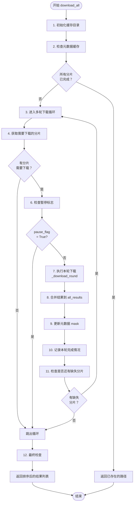
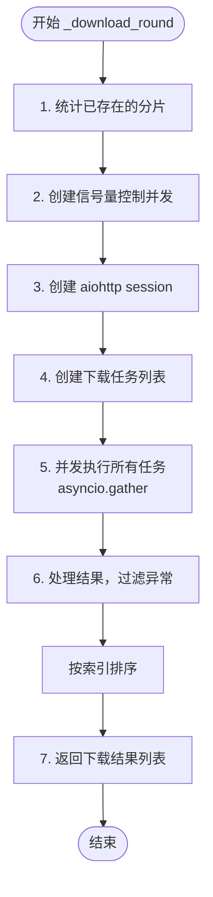
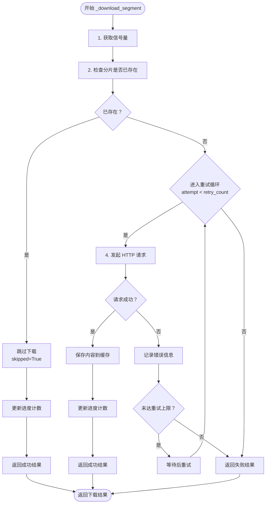
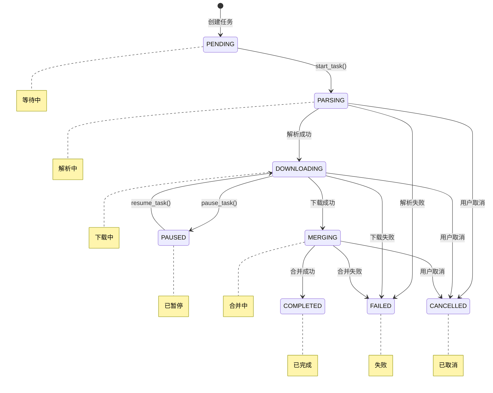
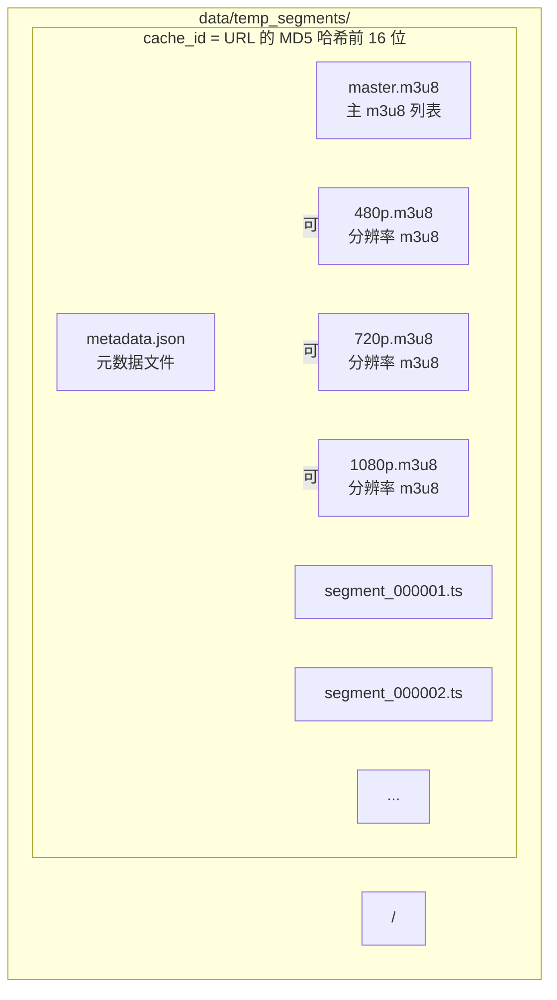
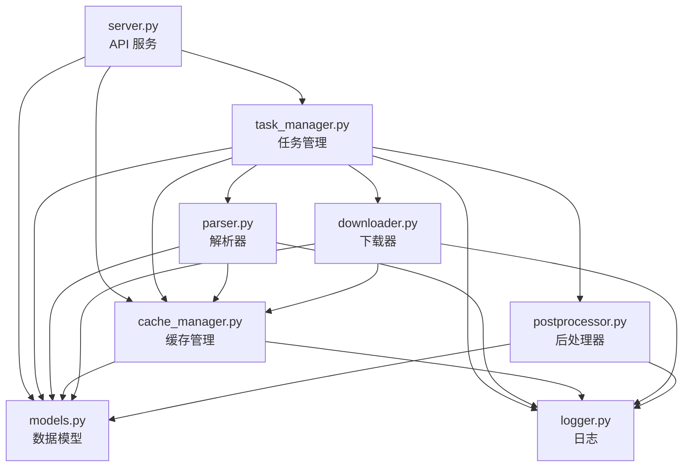

# m3u8 下载器后端实现文档

## 目录

1. [模块概览](#1-模块概览)
2. [类详细说明](#2-类详细说明)
3. [多轮次多线程分片下载流程](#3-多轮次多线程分片下载流程)
4. [任务生命周期](#4-任务生命周期)
5. [任务状态转换](#5-任务状态转换)
6. [核心数据结构](#6-核心数据结构)

---

## 1. 模块概览

后端系统由以下 8 个模块组成：

| 模块 | 文件名 | 职责 |
|------|--------|------|
| 数据模型 | `models.py` | 定义所有模块间交互的数据结构 |
| 日志模块 | `logger.py` | 统一日志配置，支持控制台和文件输出 |
| 缓存管理 | `cache_manager.py` | 管理 m3u8 文件和分片文件的缓存 |
| 解析器 | `parser.py` | 异步解析 m3u8 播放列表 |
| 下载器 | `downloader.py` | 异步分片下载，支持多轮重试 |
| 后处理器 | `postprocessor.py` | 使用 ffmpeg 合并分片并转码 |
| 任务管理 | `task_manager.py` | 管理后台下载任务的生命周期 |
| API 服务 | `server.py` | Quart 异步 HTTP API 服务 |

---

## 2. 类详细说明

### 2.1 models.py - 数据模型

#### 2.1.1 `SegmentInfo` - 分片信息

**作用**：存储单个视频分片的元数据信息，用于在解析器和下载器之间传递分片数据。

**成员**：
| 成员名 | 类型 | 说明 |
|--------|------|------|
| `url` | `str` | 分片的完整 URL 地址 |
| `index` | `int` | 分片在播放列表中的索引（从 0 开始） |
| `filename` | `str` | 分片的文件名（相对于 base_url 的路径） |

**方法**：
| 方法名 | 说明 |
|--------|------|
| `__hash__()` | 返回 url 的哈希值，使对象可用于集合操作 |
| `to_dict()` | 将对象转换为字典格式 |
| `from_dict(data)` | 从字典创建对象（类方法） |

---

#### 2.1.2 `MetaData` - 缓存元数据

**作用**：存储 m3u8 播放列表的元数据，用于断点续传和缓存管理。使用位掩码（bitmask）高效记录已下载的分片。

**成员**：
| 成员名 | 类型 | 说明 |
|--------|------|------|
| `url` | `str` | 原始 m3u8 URL |
| `base_url` | `str` | 基准 URL，用于拼接相对路径的分片 |
| `filenames` | `list[str]` | 分片文件名列表 |
| `downloaded_mask` | `int` | 位掩码，标注已下载的分片（1=已下载，0=未下载） |
| `created_at` | `str` | 创建时间（ISO 格式） |
| `version` | `str` | 元数据版本号，默认"1.0" |
| `output_name` | `Optional[str]` | 输出文件名 |
| `MAX_SEGMENTS` | `int` | 分片数量上限（10000） |

**属性**：
| 属性名 | 类型 | 说明 |
|--------|------|------|
| `total_mask` | `int` | 完整掩码（所有位都是 1） |
| `is_complete` | `bool` | 是否所有分片都已下载 |

**方法**：
| 方法名 | 说明 |
|--------|------|
| `__post_init__()` | 初始化时设置默认值并检查分片数量上限 |
| `is_segment_downloaded(index)` | 检查指定索引的分片是否已下载 |
| `set_segment_downloaded(index)` | 标记指定索引的分片为已下载 |
| `get_missing_indices()` | 获取未下载分片的索引列表 |
| `to_dict()` | 转换为字典 |
| `from_dict(data)` | 从字典创建对象 |
| `get_downloaded_count()` | 获取已下载分片数量 |

---

#### 2.1.3 `DownloadResult` - 下载结果

**作用**：封装单个分片的下载结果。

**成员**：
| 成员名 | 类型 | 说明 |
|--------|------|------|
| `segment` | `SegmentInfo` | 分片信息 |
| `success` | `bool` | 是否下载成功 |
| `local_path` | `Optional[Path]` | 本地保存路径（成功时） |
| `error` | `Optional[str]` | 错误信息（失败时） |
| `skipped` | `bool` | 是否因已存在而跳过 |

---

#### 2.1.4 `ParseResult` - 解析结果

**作用**：封装 m3u8 解析结果。

**成员**：
| 成员名 | 类型 | 说明 |
|--------|------|------|
| `segments` | `list[SegmentInfo]` | 解析出的分片列表 |
| `base_url` | `str` | 基准 URL |
| `success` | `bool` | 是否解析成功 |
| `error` | `Optional[str]` | 错误信息（失败时） |

---

#### 2.1.5 `MergeResult` - 合并结果

**作用**：封装分片合并结果。

**成员**：
| 成员名 | 类型 | 说明 |
|--------|------|------|
| `success` | `bool` | 是否合并成功 |
| `output_path` | `Optional[str]` | 输出文件路径（成功时） |
| `error` | `Optional[str]` | 错误信息（失败时） |

---

#### 2.1.6 `AppConfig` - 应用配置

**作用**：统一存储应用配置，在各模块间传递。

**成员**：
| 成员名 | 类型 | 说明 |
|--------|------|------|
| `url` | `str` | 输入 m3u8 URL |
| `threads` | `int` | 并发线程数（默认 4） |
| `timeout` | `int` | 请求超时时间（秒，默认 30） |
| `retry_count` | `int` | 重试次数（默认 3） |
| `max_download_rounds` | `int` | 最大下载轮次（默认 5） |
| `temp_dir` | `str` | 临时目录（默认"temp_segments"） |
| `output_dir` | `str` | 输出目录（默认"output"） |
| `keep_cache` | `bool` | 是否保留缓存（默认 False） |
| `ffmpeg_path` | `str` | ffmpeg 路径（默认"ffmpeg"） |
| `parsed_segments` | `list[SegmentInfo]` | 解析后的分片列表（运行时） |
| `downloaded_paths` | `list[Path]` | 已下载分片路径列表（运行时） |
| `m3u8_content` | `str` | m3u8 源文件内容（运行时） |
| `output_file` | `str` | 最终输出文件路径（运行时生成） |
| `metadata` | `Optional[MetaData]` | 元数据缓存（运行时） |

---

### 2.2 logger.py - 日志模块

#### 2.2.1 模块级函数

**`setup_logger(name, level, debug)`**
- **作用**：设置并返回配置好的日志记录器
- **参数**：
  - `name`: 日志记录器名称
  - `level`: 日志级别
  - `debug`: 是否启用调试模式
- **返回**：配置好的 Logger 实例

**`get_logger(name, debug)`**
- **作用**：获取已配置的日志记录器
- **参数**：
  - `name`: 模块名称
  - `debug`: 是否启用调试模式
- **返回**：Logger 实例

**模块级常量**：
| 常量名 | 说明 |
|--------|------|
| `LOG_DIR` | 日志目录（默认"data/logs"） |
| `LOG_FILE` | 日志文件路径 |
| `LOG_FORMAT` | 文件日志格式 |
| `CONSOLE_FORMAT` | 控制台日志格式 |
| `DATE_FORMAT` | 日期格式 |
| `_loggers` | 已创建的 logger 缓存字典 |

---

### 2.3 cache_manager.py - 缓存管理

#### 2.3.1 `CacheManager` - 缓存管理器

**作用**：管理 m3u8 文件和分片文件的缓存，支持断点续传。

**成员**：
| 成员名 | 类型 | 说明 |
|--------|------|------|
| `temp_dir` | `Path` | 临时目录根路径 |
| `url` | `str` | 原始 URL |
| `keep_cache` | `bool` | 是否保留缓存 |
| `cache_dir` | `Path` | 当前任务的缓存子目录（根据 URL 哈希生成） |

**类常量**：
| 常量名 | 说明 |
|--------|------|
| `MASTER_M3U8_FILENAME` | 主 m3u8 列表文件名（"master.m3u8"） |
| `RESOLUTION_M3U8_PATTERN` | 分辨率 m3u8 文件命名模板（"{}p.m3u8"） |
| `METADATA_FILENAME` | 元数据文件名（"metadata.json"） |

**方法**：
| 方法名 | 说明 |
|--------|------|
| `__init__(temp_dir, url, keep_cache)` | 初始化缓存管理器 |
| `_get_cache_dir()` | 根据 URL 生成缓存子目录（MD5 哈希前 16 位） |
| `init_cache()` | 初始化缓存目录 |
| `save_master_m3u8(content)` | 保存主 m3u8 列表文件 |
| `load_master_m3u8()` | 从缓存加载主 m3u8 文件内容 |
| `master_m3u8_exists()` | 检查主 m3u8 文件是否存在 |
| `_get_resolution_filename(resolution)` | 根据分辨率获取 m3u8 文件名 |
| `save_resolution_m3u8(resolution, content)` | 保存指定分辨率的 m3u8 文件 |
| `load_resolution_m3u8(resolution)` | 从缓存加载指定分辨率的 m3u8 文件 |
| `resolution_m3u8_exists(resolution)` | 检查指定分辨率的 m3u8 文件是否存在 |
| `get_segment_path(filename)` | 获取分片文件的本地路径 |
| `segment_exists(filename)` | 检查分片文件是否已存在 |
| `save_segment(filename, content)` | 保存分片文件（原子写入） |
| `get_all_segments()` | 获取缓存目录中所有的分片文件 |
| `get_all_m3u8_files()` | 获取缓存目录中所有的 m3u8 文件 |
| `clear_segments()` | 清理已下载的分片文件（保留元数据和 m3u8） |
| `clear_cache()` | 删除整个缓存目录（不受 keep_cache 影响） |
| `save_metadata(metadata)` | 保存元数据到缓存目录 |
| `update_metadata_downloaded_mask()` | 根据实际文件更新 downloaded_mask |
| `update_metadata_output_name(output_name)` | 更新元数据中的 output_name |
| `load_metadata()` | 从缓存目录加载元数据 |
| `metadata_exists()` | 检查元数据文件是否存在 |
| `get_cache_info()` | 获取缓存信息（大小、数量等） |
| `cache_path` | 属性：获取缓存目录路径 |

---

### 2.4 parser.py - m3u8 解析器

#### 2.4.1 `M3u8Parser` - 异步 m3u8 解析器

**作用**：异步解析 m3u8 播放列表，支持 Master Playlist 和子 Playlist，自动选择最高分辨率。

**成员**：
| 成员名 | 类型 | 说明 |
|--------|------|------|
| `config` | `AppConfig` | 应用配置 |
| `cache_manager` | `CacheManager` | 缓存管理器 |
| `timeout` | `int` | 请求超时时间 |
| `_session` | `Optional[aiohttp.ClientSession]` | aiohttp 会话 |

**类常量**：
| 常量名 | 说明 |
|--------|------|
| `HEADERS` | HTTP 请求头（User-Agent） |

**方法**：
| 方法名 | 说明 |
|--------|------|
| `__init__(config, cache_manager)` | 初始化解析器 |
| `parse(force_refresh)` | 异步解析 m3u8 文件（主入口） |
| `_try_load_from_metadata_cache()` | 尝试从元数据缓存加载 |
| `_get_m3u8_content(force_refresh)` | 获取 m3u8 内容（从缓存或网络） |
| `_parse_playlist(content, base_url, force_refresh)` | 解析 m3u8 内容，处理 Master/子 Playlist |
| `_get_sub_playlist_content(playlist, resolution, force_refresh)` | 获取子 playlist 内容 |
| `_cache_other_resolutions(playlist, best_resolution)` | 异步缓存其他分辨率的子 playlist |
| `_fetch_and_cache_resolution(sub_playlist)` | 获取并缓存单个分辨率的 m3u8 文件 |
| `_fetch_url(url)` | 异步获取 URL 内容 |
| `_rebuild_segments_from_metadata(metadata)` | 从元数据重建分片信息列表 |
| `_save_metadata(url, base_url, segments)` | 保存元数据到缓存 |
| `_get_base_url(url)` | 获取 URL 的基准路径 |
| `_extract_query_params(url)` | 提取 URL 中的查询参数 |
| `_is_relative_segment_url(segment_url, base_url)` | 判断分片 URL 是否是相对路径拼接 |
| `_append_query_params(url, query_params)` | 给 URL 附加查询参数 |
| `_extract_segments(playlist, base_url)` | 从 m3u8 playlist 中提取分片 |
| `_get_segment_filename(url_path, base_url, index)` | 生成分片文件名 |

---

### 2.5 downloader.py - 分片下载器

#### 2.5.1 `SegmentDownloader` - 异步分片下载器

**作用**：异步下载所有视频分片，支持多轮重试、断点续传、并发控制。

**成员**：
| 成员名 | 类型 | 说明 |
|--------|------|------|
| `config` | `AppConfig` | 应用配置 |
| `cache_manager` | `CacheManager` | 缓存管理器 |
| `timeout` | `int` | 请求超时时间 |
| `retry_count` | `int` | 重试次数 |
| `threads` | `int` | 并发连接数 |
| `_semaphore` | `Optional[asyncio.Semaphore]` | 并发控制信号量 |
| `_session` | `Optional[aiohttp.ClientSession]` | aiohttp 会话 |
| `_progress_callback` | `callable` | 进度回调函数 |
| `_completed_count` | `int` | 已完成计数（成功下载的分片数） |
| `_total_count` | `int` | 总数量 |
| `_pause_flag` | `Optional[bool]` | 暂停标志（外部传入） |

**类常量**：
| 常量名 | 说明 |
|--------|------|
| `HEADERS` | HTTP 请求头（User-Agent） |

**方法**：
| 方法名 | 说明 |
|--------|------|
| `__init__(config, cache_manager, progress_callback, pause_flag)` | 初始化下载器 |
| `download_all(segments)` | 异步下载所有分片（多轮重试，主入口） |
| `_get_segments_to_download(segments, existing_results)` | 获取需要下载的分片列表 |
| `_get_missing_indices(segments, existing_results)` | 获取未下载成功的分片索引 |
| `_download_round(segments_to_download, total_segments)` | 执行一轮下载 |
| `_update_metadata_mask()` | 更新元数据中的 downloaded_mask |
| `_download_segment(segment, total)` | 异步下载单个分片 |
| `_notify_progress()` | 通知进度更新 |
| `get_success_paths(results)` | 从下载结果中提取成功下载的路径 |

---

### 2.6 postprocessor.py - 后处理器

#### 2.6.1 `MediaPostprocessor` - 异步媒体后处理器

**作用**：使用 ffmpeg 异步合并分片并转换为 mp4 格式。

**成员**：
| 成员名 | 类型 | 说明 |
|--------|------|------|
| `config` | `AppConfig` | 应用配置 |
| `output_file` | `str` | 输出文件路径 |
| `ffmpeg_path` | `str` | ffmpeg 可执行文件路径 |

**方法**：
| 方法名 | 说明 |
|--------|------|
| `__init__(config)` | 初始化后处理器 |
| `_get_unique_output_path(output_path)` | 获取唯一的输出文件路径（避免覆盖） |
| `merge(segment_paths)` | 异步合并分片并转换为 mp4（主入口） |
| `_check_ffmpeg()` | 异步检查 ffmpeg 是否可用 |
| `_create_ffmpeg_list_file(segment_paths)` | 创建 ffmpeg 所需的文件列表 |
| `_run_ffmpeg(list_file, work_dir)` | 异步执行 ffmpeg 命令 |

---

### 2.7 task_manager.py - 任务管理器

#### 2.7.1 `TaskStatus` - 任务状态枚举

**作用**：定义任务的所有可能状态。

| 状态值 | 说明 |
|--------|------|
| `PENDING` | 等待中 |
| `PARSING` | 解析中 |
| `DOWNLOADING` | 下载中 |
| `MERGING` | 合并中 |
| `COMPLETED` | 已完成 |
| `FAILED` | 失败 |
| `CANCELLED` | 已取消 |
| `PAUSED` | 已暂停 |

---

#### 2.7.2 `TaskProgress` - 任务进度

**作用**：存储任务的实时进度信息。

**成员**：
| 成员名 | 类型 | 说明 |
|--------|------|------|
| `status` | `TaskStatus` | 当前状态 |
| `progress_percent` | `float` | 进度百分比（0-100） |
| `current_step` | `str` | 当前步骤描述 |
| `segments_downloaded` | `int` | 已下载分片数 |
| `total_segments` | `int` | 总分片数 |
| `error` | `Optional[str]` | 错误信息 |
| `result` | `Optional[dict]` | 最终结果 |
| `created_at` | `str` | 创建时间 |
| `started_at` | `Optional[str]` | 开始时间 |
| `completed_at` | `Optional[str]` | 完成时间 |

**方法**：
| 方法名 | 说明 |
|--------|------|
| `__post_init__()` | 初始化时设置创建时间 |
| `to_dict()` | 转换为字典 |

---

#### 2.7.3 `DownloadTask` - 下载任务

**作用**：封装单个下载任务的完整信息。

**成员**：
| 成员名 | 类型 | 说明 |
|--------|------|------|
| `task_id` | `str` | 任务 ID（URL 的 MD5 哈希前 16 位） |
| `config` | `AppConfig` | 应用配置 |
| `progress` | `TaskProgress` | 任务进度 |
| `_cancel_flag` | `bool` | 取消标志 |
| `_pause_flag` | `bool` | 暂停标志 |

**方法**：
| 方法名 | 说明 |
|--------|------|
| `to_dict()` | 转换为字典 |

---

#### 2.7.4 `TaskManager` - 任务管理器

**作用**：管理后台下载任务的创建、跟踪、暂停、恢复和取消。

**成员**：
| 成员名 | 类型 | 说明 |
|--------|------|------|
| `_tasks` | `Dict[str, DownloadTask]` | 所有任务的字典（task_id -> task） |
| `_task_futures` | `Dict[str, asyncio.Task]` | 所有任务的未来对象 |

**方法**：
| 方法名 | 说明 |
|--------|------|
| `__init__()` | 初始化任务管理器 |
| `get_task_by_id(url)` | 根据 URL 获取任务 |
| `create_task(url, threads, output_dir, temp_dir, max_rounds, keep_cache, output_name, ffmpeg_path)` | 创建新的下载任务 |
| `get_task(task_id)` | 获取任务 |
| `_get_output_name_from_cache(task)` | 从缓存中获取任务的输出文件名 |
| `get_task_status(task_id)` | 获取任务状态 |
| `list_tasks()` | 列出所有任务 |
| `cancel_task(task_id)` | 取消任务 |
| `pause_task(task_id)` | 暂停任务（异步） |
| `resume_task(task_id)` | 恢复暂停的任务 |
| `remove_task(task_id)` | 移除已结束的任务 |
| `execute_task(task)` | 执行下载任务（异步，主入口） |
| `_execute_parse(task_id, config, cache_manager)` | 执行解析阶段 |
| `_execute_download(task_id, task, config, cache_manager, progress)` | 执行下载阶段 |
| `_execute_merge(task_id, task, config, cache_manager, progress)` | 执行合并阶段 |
| `start_task(task_id)` | 启动后台任务 |
| `_create_cancelled_result(task)` | 创建取消结果 |
| `_save_output_name_to_cache(cache_manager, output_file)` | 保存输出文件名到缓存元数据 |

**全局实例**：
| 实例名 | 说明 |
|--------|------|
| `task_manager` | 全局任务管理器实例 |

---

### 2.8 server.py - API 服务

#### 2.8.1 Quart 应用

**作用**：提供异步 HTTP API 服务，支持任务提交、状态查询、缓存管理等。

**全局配置**：
| 配置项 | 说明 |
|--------|------|
| `server_config` | 服务器配置字典（max_threads, temp_dir, output_dir） |
| `DEFAULT_TEMP_DIR` | 默认临时目录 |
| `DEFAULT_OUTPUT_DIR` | 默认输出目录 |

**API 端点**：

| 端点 | 方法 | 说明 |
|------|------|------|
| `/health` | GET | 健康检查 |
| `/api/config` | GET | 获取服务器配置 |
| `/api/download` | POST | 提交下载任务 |
| `/api/tasks` | GET | 列出所有任务 |
| `/api/tasks/<task_id>` | GET | 获取任务状态 |
| `/api/tasks/<task_id>` | DELETE | 删除任务 |
| `/api/tasks/<task_id>/pause` | POST | 暂停任务 |
| `/api/tasks/<task_id>/resume` | POST | 恢复任务 |
| `/api/cache/list` | GET | 列出所有缓存 |
| `/api/cache/<cache_id>` | GET | 获取缓存详情 |
| `/api/cache/<cache_id>` | DELETE | 删除缓存 |
| `/api/cache/clear` | POST | 清空所有缓存 |
| `/api/cache/update` | POST | 更新缓存元数据 |

**辅助函数**：
| 函数名 | 说明 |
|--------|------|
| `_validate_download_request(data)` | 验证下载请求参数 |
| `_create_task_from_request(data)` | 从请求数据创建任务 |
| `_handle_existing_task(task)` | 处理已存在的任务 |
| `_get_cache_manager(cache_dir, keep_cache)` | 创建 CacheManager 实例 |
| `_build_cache_info(cache_dir)` | 构建缓存信息字典 |
| `_get_task_cache_ids()` | 获取任务列表中所有任务对应的缓存 ID |
| `parse_args()` | 解析命令行参数 |
| `main()` | 主函数（启动服务） |

---

## 3. 多轮次多线程分片下载流程

### 3.1 download_all 主流程



### 3.2 单轮下载流程（_download_round）



### 3.3 单分片下载流程（_download_segment）



---

## 4. 任务生命周期

### 4.1 任务生命周期流程图

```mermaid
flowchart TD
    User([用户提交请求]) -->|POST /api/download| CreateTask[TaskManager.create_task]
    
    subgraph CreateTaskSub [任务创建]
        CreateTask --> GenID[1. 生成 task_id<br/>URL 的 MD5 前 16 位]
        GenID --> CreateConfig[2. 创建 AppConfig]
        CreateConfig --> CreateCache[3. 创建 CacheManager]
        CreateCache --> CreateTaskObj[4. 创建 DownloadTask]
        CreateTaskObj --> SetPending[5. 设置状态：PENDING]
        SetPending --> StoreTask[6. 存入_tasks 字典]
    end
    
    StoreTask --> StartTask[TaskManager.start_task]
    StartTask --> ExecuteTask[TaskManager.execute_task<br/>异步执行]
    
    ExecuteTask --> Parsing[阶段 1: PARSING 解析]
    
    subgraph ParsingSub [解析阶段]
        Parsing --> SetParsing[设置状态=PARSING]
        SetParsing --> CallParser[调用 M3u8Parser.parse]
        CallParser --> CheckMetaCache{检查元数据<br/>缓存}
        CheckMetaCache --> GetM3u8[获取 m3u8 内容]
        GetM3u8 --> ParseMaster{是 Master<br/>Playlist?}
        ParseMaster -->|是 | SelectBest[选择最高分辨率]
        ParseMaster -->|否 | ExtractSeg[提取分片列表]
        SelectBest --> ExtractSeg
        ExtractSeg --> SaveMeta[保存元数据到缓存]
        SaveMeta --> SaveOutputName[保存输出文件名]
    end
    
    SaveOutputName --> ParseResult{解析结果？}
    ParseResult -->|成功 | Downloading[阶段 2: DOWNLOADING 下载]
    ParseResult -->|失败/取消 | Failed[FAILED 失败]
    
    subgraph DownloadingSub [下载阶段]
        Downloading --> SetDownloading[设置状态=DOWNLOADING]
        SetDownloading --> SetProgress[设置进度=10%]
        SetProgress --> CreateDownloader[创建 SegmentDownloader]
        CreateDownloader --> CallDownloadAll[调用 download_all]
        CallDownloadAll --> MultiRound[多轮次下载循环]
        MultiRound --> CheckPauseFlag{检查暂停标志}
        CheckPauseFlag -->|暂停 | SetPaused[设置状态=PAUSED]
        CheckPauseFlag -->|继续 | CheckResults{检查下载结果}
        CheckResults -->|全部失败 | ThrowException[抛出异常]
        CheckResults -->|部分失败 | LogWarning[记录日志]
        CheckResults -->|成功 | ContinueMerge[继续合并阶段]
    end
    
    SetPaused --> PauseWait[等待用户恢复]
    PauseWait -->|resume_task| Downloading
    
    ThrowException --> Failed
    LogWarning --> ContinueMerge{下载成功？}
    ContinueMerge -->|否 | Failed
    ContinueMerge -->|是 | Merging[阶段 3: MERGING 合并]
    
    subgraph MergingSub [合并阶段]
        Merging --> SetMerging[设置状态=MERGING]
        SetMerging --> CreatePostproc[创建 MediaPostprocessor]
        CreatePostproc --> CallMerge[调用 merge]
        CallMerge --> CheckFFmpeg{检查 ffmpeg}
        CheckFFmpeg -->|不可用 | MergeFailed[合并失败]
        CheckFFmpeg -->|可用 | CreateList[创建临时文件列表]
        CreateList --> RunFFmpeg[执行 ffmpeg 命令]
        RunFFmpeg --> CleanTemp[清理临时文件]
        CleanTemp --> CleanCache{清理分片缓存}
    end
    
    MergeFailed --> Failed
    CleanCache --> MergeResult{合并结果？}
    MergeResult -->|成功 | Completed[COMPLETED 完成]
    MergeResult -->|失败 | Failed
    
    subgraph CompletedSub [完成]
        Completed --> SetCompleted[设置状态=COMPLETED]
        SetCompleted --> SetProgress100[设置进度=100%]
        SetProgress100 --> SetCompletedTime[设置完成时间]
        SetCompletedTime --> SaveResult[保存结果]
    end
    
    subgraph FailedSub [失败]
        Failed --> SetFailed[设置状态=FAILED]
        SetFailed --> SetError[设置错误信息]
        SetFailed --> SetFailedTime[设置完成时间]
    end
    
    subgraph CancelledSub [取消]
        Cancelled[CANCELLED 已取消] --> SetCancelled[设置状态=CANCELLED]
        SetCancelled --> SetCancelledTime[设置完成时间]
    end
    
    ExecuteTask -.->|用户取消 | Cancelled
    
    Completed --> QueryStatus[GET /api/tasks/<task_id>]
    Failed --> QueryStatus
    Cancelled --> QueryStatus
    
    QueryStatus --> ReturnStatus([返回任务状态])
```



### 4.2 任务各阶段说明

| 阶段 | 状态 | 进度范围 | 主要工作 |
|------|------|----------|----------|
| 等待中 | PENDING | 0% | 任务已创建，等待启动 |
| 解析中 | PARSING | 0-10% | 解析 m3u8，获取分片列表 |
| 下载中 | DOWNLOADING | 10-80% | 多轮次下载分片 |
| 合并中 | MERGING | 80-100% | 使用 ffmpeg 合并分片 |
| 已完成 | COMPLETED | 100% | 任务成功完成 |
| 失败 | FAILED | - | 任务执行失败 |
| 已取消 | CANCELLED | - | 用户取消任务 |
| 已暂停 | PAUSED | - | 任务暂停（可在下载阶段暂停） |

---

## 5. 任务状态转换

### 5.1 状态转换图



### 5.2 状态转换表

| 当前状态 | 可能转换到的状态 | 触发条件 |
|----------|------------------|----------|
| PENDING | PARSING | start_task() 启动任务 |
| PARSING | DOWNLOADING | m3u8 解析成功 |
| PARSING | FAILED | m3u8 解析失败 |
| PARSING | CANCELLED | 用户取消任务 |
| DOWNLOADING | PAUSED | pause_task() 暂停任务 |
| DOWNLOADING | MERGING | 所有分片下载成功 |
| DOWNLOADING | FAILED | 下载失败 |
| DOWNLOADING | CANCELLED | 用户取消任务 |
| PAUSED | DOWNLOADING | resume_task() 恢复任务 |
| MERGING | COMPLETED | 合并成功 |
| MERGING | FAILED | 合并失败 |
| MERGING | CANCELLED | 用户取消任务 |

### 5.3 终端状态

以下状态为终端状态，任务进入这些状态后不会再自动转换：

| 状态 | 说明 | 可执行操作 |
|------|------|------------|
| COMPLETED | 已完成 | 可删除任务（remove_task） |
| FAILED | 失败 | 可删除任务（remove_task） |
| CANCELLED | 已取消 | 可删除任务（remove_task） |
| PAUSED | 已暂停 | 可恢复任务（resume_task）、删除任务 |

---

## 6. 核心数据结构

### 6.1 数据流图

```mermaid
flowchart TD
    UserReq([用户请求]) -->|POST /api/download<br/>{url, threads, output...}| APIServer[API Server<br/>server.py]
    
    APIServer -->|创建任务 | TaskMgr[TaskManager]
    
    subgraph TaskMgrSub [任务管理]
        TaskMgr --> DownloadTask[DownloadTask]
        DownloadTask --> task_id["task_id: str"]
        DownloadTask --> config["config: AppConfig"]
        DownloadTask --> progress["progress: TaskProgress"]
    end
    
    TaskMgr -->|执行任务 | ExecuteTask[execute_task]
    
    subgraph ExecuteTaskSub [任务执行]
        ExecuteTask --> Phase1[阶段 1: PARSING]
        
        subgraph Phase1Sub [解析阶段]
            Phase1 --> M3u8Parser[M3u8Parser.parse]
            M3u8Parser --> ParseResult[ParseResult]
            ParseResult --> segments["segments: list[SegmentInfo]"]
            ParseResult --> base_url["base_url: str"]
            ParseResult --> success1["success: bool"]
        end
        
        Phase1 --> Phase2[阶段 2: DOWNLOADING]
        
        subgraph Phase2Sub [下载阶段]
            Phase2 --> SegDownloader[SegmentDownloader.download_all]
            SegDownloader --> DownloadResults[list[DownloadResult]]
            DownloadResults --> seg_info["segment: SegmentInfo"]
            DownloadResults --> success2["success: bool"]
            DownloadResults --> local_path["local_path: Path"]
            DownloadResults --> error["error: str"]
        end
        
        Phase2 --> Phase3[阶段 3: MERGING]
        
        subgraph Phase3Sub [合并阶段]
            Phase3 --> PostProc[MediaPostprocessor.merge]
            PostProc --> MergeResult[MergeResult]
            MergeResult --> success3["success: bool"]
            MergeResult --> output_path["output_path: str"]
            MergeResult --> error2["error: str"]
        end
    end
    
    ExecuteTask --> QueryAPI[GET /api/tasks/<task_id>]
    
    QueryAPI --> Response([返回任务状态])
    
    subgraph ResponseSub [响应数据]
        Response --> resp_task_id["task_id"]
        Response --> resp_url["url"]
        Response --> resp_progress["progress"]
        resp_progress --> status["status: completed"]
        resp_progress --> pct["progress_percent: 100.0"]
        resp_progress --> seg_downloaded["segments_downloaded: 100"]
        resp_progress --> seg_total["total_segments: 100"]
        Response --> output_name["output_name: video.mp4"]
    end
```

### 6.2 缓存结构



### 6.3 元数据结构 (metadata.json)

```json
{
  "version": "1.0",
  "url": "https://example.com/playlist.m3u8",
  "base_url": "https://example.com/",
  "filenames": [
    "segment_000001.ts",
    "segment_000002.ts",
    "segment_000003.ts"
  ],
  "downloaded_mask": 5,
  "created_at": "2024-01-01T00:00:00.000000",
  "output_name": "video.mp4"
}
```

**downloaded_mask 说明**：
- 使用位掩码记录已下载的分片
- 第 n 位为 1 表示第 n 个分片已下载
- 示例：5 = 0b101，表示第 0 和第 2 个分片已下载

---

## 附录：模块依赖关系


