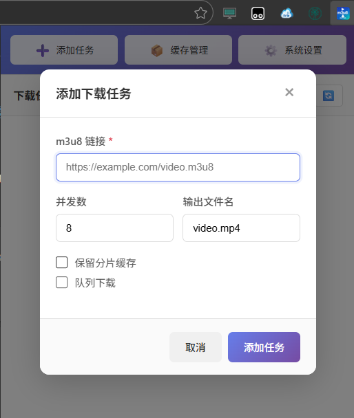
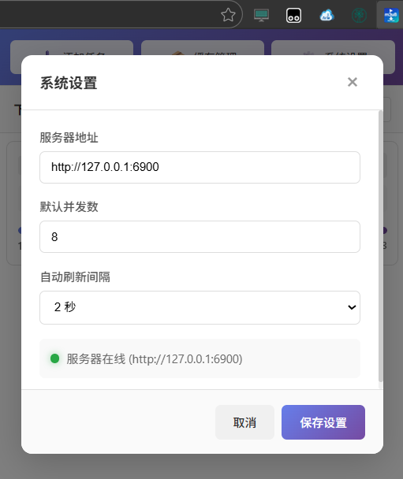
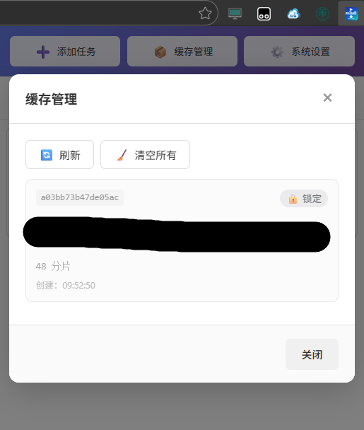
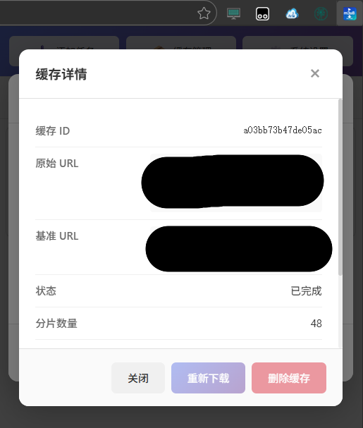
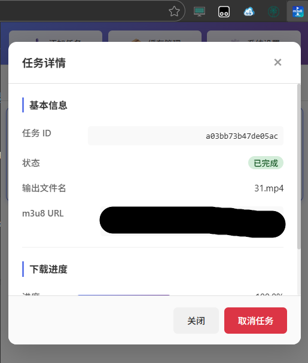
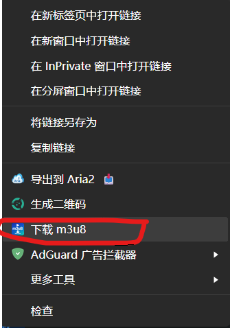

# m3u8 下载器 Edge 插件

这是 m3u8 下载器的**官方前端**，一个基于 Manifest V3 规范的 Edge 浏览器插件，用于管理 m3u8 视频下载任务。

## 插件简介

m3u8 下载器 Edge 插件是一款专为视频下载设计的浏览器扩展，提供直观的任务管理界面和便捷的右键菜单功能。插件与后端服务配合使用，支持提交下载任务、实时跟踪进度、管理缓存等功能。

### 主要特点

- 🎨 **现代化 UI 设计**：采用渐变紫色主题，简洁美观的界面设计
- 📋 **任务列表管理**：实时显示所有下载任务的进度和状态
- 🔄 **自动刷新**：可配置的自动刷新间隔，实时跟踪下载进度
- 🖱️ **右键菜单集成**：支持在视频/音频/链接上右键快速创建下载任务
- 📦 **缓存管理**：查看和管理已下载的分片缓存，支持重新下载和删除操作
- ⚙️ **灵活配置**：支持自定义服务器地址、端口、并发数等参数
- 🔔 **通知提醒**：操作结果通过气泡提示和系统通知反馈

### 界面预览

#### 主界面


*主界面显示任务列表，支持添加任务、删除任务、缓存管理和系统设置*

#### 添加任务



*输入 m3u8 链接，配置并发数和输出文件名，支持保留分片缓存选项*

#### 系统设置



*配置服务器地址、默认并发数和自动刷新间隔*

#### 缓存管理



*查看所有缓存记录，支持刷新、清空和详情查看*

#### 缓存详情



*显示缓存的详细信息，包括 URL、分片数量等*

#### 任务详情



*显示任务的完整信息，包括进度、时间信息和错误详情*

#### 右键菜单



*在视频、音频或链接上右键，快速创建下载任务*

## 详细功能介绍

### 主界面

主界面是插件的核心操作区域，提供任务列表展示和快捷操作入口。

#### 界面布局

- **工具栏**：位于顶部，包含三个功能按钮
  - **添加任务**（➕）：打开添加任务对话框
  - **缓存管理**（📦）：打开缓存管理界面
  - **系统设置**（⚙️）：打开系统设置对话框

- **任务列表区域**：显示所有下载任务
  - 任务卡片显示任务 ID、状态、输出文件名、进度条、分片信息
  - 支持单击选中任务，双击查看任务详情
  - 失败任务显示"重试"按钮，可快速重新提交下载

#### 任务状态说明

| 状态 | 说明 |
|------|------|
| 等待中 | 任务已创建，等待开始处理 |
| 解析中 | 正在解析 m3u8 文件 |
| 下载中 | 正在下载视频分片 |
| 合并中 | 正在合并分片为完整视频 |
| 已完成 | 下载完成 |
| 失败 | 下载失败，可查看错误信息并重试 |
| 已取消 | 任务已被取消 |

#### 操作说明

1. **查看任务列表**：打开插件即可看到所有下载任务
2. **选中任务**：单击任务卡片可选中
3. **查看详情**：双击任务卡片打开任务详情对话框
4. **刷新列表**：点击右上角的 🔄 按钮手动刷新任务列表
5. **重试失败任务**：失败任务卡片上显示"重试"按钮，点击即可重新提交

---

### 添加任务

通过添加任务功能，可以手动提交 m3u8 链接创建下载任务。

#### 界面元素

- **m3u8 链接**（必填）：输入要下载的视频 m3u8 地址
- **并发数**：设置同时下载的分片数量，默认 8
- **输出文件名**：设置保存的文件名，自动从 URL 提取，可手动修改
- **保留分片缓存**：勾选后下载完成不删除分片缓存

#### 操作步骤

1. 点击工具栏的"添加任务"按钮
2. 在弹出的对话框中输入 m3u8 链接
3. （可选）调整并发数和输出文件名
4. （可选）勾选"保留分片缓存"
5. 点击"添加任务"按钮提交

#### 功能特性

- **自动解析文件名**：输入链接后自动从 URL 提取文件名并填充到输出字段
- **快速提交**：支持按回车键快速提交表单
- **链接验证**：输入必须是有效的 URL 格式

---

### 系统设置

系统设置用于配置插件与后端服务的连接参数和默认行为。

#### 配置项

| 配置项 | 说明 | 默认值 |
|--------|------|--------|
| 服务器地址 | 后端服务的完整地址，包含协议、主机和端口 | http://127.0.0.1:6900 |
| 默认并发数 | 添加任务时的默认并发数量（1-32） | 8 |
| 自动刷新间隔 | 任务列表自动刷新的时间间隔 | 2 秒 |

#### 服务器状态指示

设置对话框底部显示服务器连接状态：

- 🟢 **服务器在线**：绿色指示灯，显示当前连接的地址
- 🔴 **服务器离线**：红色指示灯，表示无法连接到后端服务

#### 操作步骤

1. 点击工具栏的"系统设置"按钮
2. 修改需要调整的配置项
3. 点击"保存设置"按钮

#### 注意事项

- 服务器地址支持完整的 URL 格式，如 `http://192.168.1.100:6900` 或 `https://example.com:443`
- 自动刷新间隔可选：不刷新、1 秒、2 秒、5 秒、10 秒
- 服务器离线时，添加任务和删除任务功能将被禁用
- 配置自动保存，下次打开插件时自动应用

---

### 缓存管理

缓存管理功能用于查看和管理已下载的视频分片缓存数据。

#### 界面布局

- **工具栏**：
  - **刷新**（🔄）：重新加载缓存列表
  - **清空所有**（🧹）：删除所有缓存记录

- **缓存列表**：显示所有缓存记录
  - 缓存 ID（URL 的 MD5 哈希）
  - 状态标签：已完成/下载中/锁定
  - 原始 URL
  - 分片数量和 m3u8 文件数
  - 创建时间

#### 缓存状态说明

| 状态 | 图标 | 说明 |
|------|------|------|
| 已完成 | ✅ | 缓存已完整，可重复使用 |
| 下载中 | ⏳ | 缓存正在被下载任务使用 |
| 锁定 | 🔒 | 缓存被活动任务占用，无法删除或重新下载 |

#### 缓存详情

点击任意缓存项可查看详细信息：

- 缓存 ID
- 原始 URL
- 基准 URL
- 状态
- 分片数量
- 已下载数量
- 创建时间

#### 操作说明

1. **查看缓存列表**：点击"缓存管理"按钮打开对话框
2. **刷新列表**：点击"刷新"按钮重新加载缓存数据
3. **查看详情**：点击缓存项打开详情对话框
4. **重新下载**：在详情对话框中点击"重新下载"，使用缓存的 URL 重新创建下载任务
5. **删除缓存**：在详情对话框中点击"删除缓存"，删除单个缓存记录
6. **清空所有**：点击"清空所有"按钮，删除所有非锁定状态的缓存

#### 注意事项

- 被活动任务锁定的缓存无法删除或重新下载
- 清空所有缓存前会弹出确认对话框
- 缓存详情对话框中显示操作按钮的可用状态
- 重新下载功能会使用缓存的 URL 和默认配置创建新的下载任务

---

### 任务详情

任务详情功能提供单个下载任务的完整信息和操作选项。

#### 信息展示

任务详情对话框分为四个部分：

**1. 基本信息**
- 任务 ID
- 当前状态
- 输出文件名
- m3u8 URL

**2. 下载进度**
- 当前步骤
- 进度条和百分比
- 分片下载进度（已下载/总数）

**3. 时间信息**
- 创建时间
- 开始时间
- 完成时间

**4. 错误/结果信息**（如有）
- 错误信息：任务失败时显示具体错误原因
- 下载结果：任务完成时显示最终结果详情

#### 操作说明

1. **打开详情**：双击任务列表中的任意任务卡片
2. **取消任务**：点击"取消任务"按钮可取消正在执行的任务
3. **查看详情**：所有信息均为只读，用于了解任务状态

#### 状态标识

任务详情中使用彩色状态标签区分不同状态：

- 🟡 等待中
- 🔵 解析中
- 🔵 下载中
- 🟣 合并中
- 🟢 已完成
- 🔴 失败
- ⚪ 已取消

---

### 右键菜单

右键菜单功能允许用户在网页上直接快速创建下载任务。

#### 支持的上下文

右键菜单在以下元素上显示：

- **链接**（link）：右键点击 m3u8 链接
- **音频**（audio）：右键点击音频元素
- **视频**（video）：右键点击视频元素

#### 操作步骤

1. 在网页上找到视频、音频或 m3u8 链接
2. 右键点击该元素
3. 在菜单中选择"下载 m3u8"
4. 系统自动创建下载任务并显示通知

#### 功能特性

- **自动提取链接**：自动获取点击元素的 URL 地址
- **智能命名**：从 URL 自动提取文件名作为输出
- **快速创建**：无需打开插件界面即可提交任务
- **通知反馈**：任务创建成功或失败时显示系统通知

#### 注意事项

- 右键菜单功能需要后端服务处于运行状态
- 如果插件弹窗未打开，任务将通过后台脚本直接提交
- 首次使用通知功能时，浏览器可能会请求通知权限

---

## 技术说明

### 文件结构

```
extension/
├── manifest.json      # 插件配置文件 (Manifest V3)
├── popup.html         # 插件主页面
├── popup.css          # 样式文件
├── popup.js           #  popup 逻辑脚本
├── background.js      # 后台服务脚本
├── build.js           # 构建脚本
├── package.json       # npm 配置
└── icons/
    ├── icon.svg       # 图标源文件
    ├── icon16.png     # 16x16 图标
    ├── icon48.png     # 48x48 图标
    └── icon128.png    # 128x128 图标
```

### 权限说明

| 权限 | 用途 |
|------|------|
| `storage` | 保存用户配置（服务器地址、并发数等） |
| `tabs` | 与网页标签通信，发送下载指令 |
| `contextMenus` | 创建右键菜单 |
| `host_permissions` | 访问后端 API 服务 |

### API 配置

插件默认连接 `http://127.0.0.1:6900`，可在"系统设置"中修改：

| 设置项 | 默认值 | 说明 |
|--------|--------|------|
| 服务器地址 | 127.0.0.1 | 后端服务 IP |
| 端口 | 6900 | 后端服务端口 |
| 默认并发数 | 8 | 下载任务默认并发数 |
| 自动刷新间隔 | 2 秒 | 任务列表自动刷新间隔 |

### 后端服务

本插件需要配合 m3u8 下载器后端服务使用。启动后端服务：

```bash
python backend/server.py --host 127.0.0.1 --port 6900
```

详细 API 文档请参考 [API.md](../API.md)。

## 开发说明

- 插件使用 Manifest V3 规范开发
- 使用 Chrome Storage API 保存配置
- 使用 Fetch API 与后端服务通信
- 使用 Chrome Context Menus API 创建右键菜单
- 使用 Chrome Notifications API 显示系统通知

## 许可证

GNU General Public License v3.0 (GPL-3.0)
