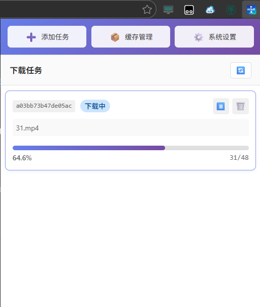

# m3u8 下载器

> **项目说明**: 本项目完全由 AI 开发，开发此项目的模型是 **Qwen Code**（阿里巴巴通义千问）。

一个基于异步架构的 m3u8 视频下载器，提供 RESTful API 后端服务和 Edge 浏览器插件前端。

## 项目结构

```
m3u8-downloader/
├── backend/                # 后端服务
│   ├── server.py          # Quart 异步 API 服务
│   ├── task_manager.py    # 任务管理器（后台任务管理）
│   ├── models.py          # 数据模型
│   ├── logger.py          # 日志模块
│   ├── cache_manager.py   # 缓存管理
│   ├── parser.py          # 异步 m3u8 解析
│   ├── downloader.py      # 异步分片下载
│   └── postprocessor.py   # 异步后处理 (ffmpeg 合并)
│
├── extension/              # Edge 浏览器插件（官方前端）
│   ├── manifest.json      # 插件配置文件
│   ├── popup.html         # 插件页面
│   ├── popup.js           # 逻辑脚本
│   └── icons/             # 图标文件
│
├── tools/                  # 工具目录
│   └── test_cli.py        # CLI 测试工具（支持下载、任务管理、缓存管理）
│
├── docker/                 # Docker 相关配置
├── requirements.txt       # 依赖列表
└── API.md                 # 完整 API 文档
```

## 快速开始

### 1. 安装依赖

```bash
pip install -r requirements.txt
```

### 2. 启动后端服务

```bash
python backend/server.py
```

后端服务默认监听 `127.0.0.1:6900`

可选参数：
- `--host`: 监听地址 IP (默认：127.0.0.1)
- `--port`: 监听端口 (默认：6900)
- `--max-threads`: 下载并发数上限 (默认：32)。如果 API 请求传入的 threads 值大于此值，将使用此值。
- `--log-level`: 日志级别 DEBUG|INFO|WARNING|ERROR|CRITICAL (默认：INFO)
- `--log-dir`: 日志目录 (默认：logs)
- `--debug`: 启用调试模式（等同于 --log-level DEBUG）
- `--temp-dir`: 临时分片目录 (默认：data/temp_segments)
- `--output-dir`: 输出目录 (默认：output)

示例：
```bash
# 监听所有地址，端口 8080
python backend/server.py --host 0.0.0.0 --port 8080

# 设置最大 16 并发，DEBUG 日志
python backend/server.py --max-threads 16 --log-level DEBUG
```

### 3. 使用 Edge 插件下载视频

1. 从本项目的 [Release 页面](https://github.com/ZZH-Finalize/m3u8-downloader/releases) 下载打包好的 Edge 插件（`.zip` 文件）
2. 打开 Edge 浏览器，访问 `edge://extensions/`
3. 开启"开发人员模式"
4. 直接拖拽到扩展页面安装
5. 确保后端服务已启动
6. 点击浏览器工具栏中的插件图标，提交下载任务



详细说明请查看 [extension/README.md](extension/README.md)。

## API 简介

提交异步下载任务，立即返回 `task_id`，后台异步执行。

**请求**
```http
POST /api/download
Content-Type: application/json
```

**请求参数**
| 字段 | 类型 | 必填 | 默认值 | 说明 |
|------|------|------|--------|------|
| `url` | string | 是 | - | m3u8 文件的 URL |
| `threads` | int | 否 | `max-threads` | 下载并发数（如果大于 `max-threads`，则使用 `max-threads`） |
| `output` | string | 否 | `"video.mp4"` | 输出文件名 |
| `max_rounds` | int | 否 | `5` | 最大下载轮次（重试次数） |
| `keep_cache` | boolean | 否 | `false` | 是否保留缓存文件 |
| `debug` | boolean | 否 | `false` | 是否启用调试日志 |

**成功响应**
```json
{
    "success": true,
    "task_id": "abc12345",
    "status": "pending",
    "message": "任务已提交，后台执行中"
}
```

**说明**
- 该接口是异步接口，提交任务后立即返回
- 使用返回的 `task_id` 可通过 `/api/tasks/<task_id>` 查询进度
- `task_id` 是 URL 的 MD5 哈希值（前 16 位字符），与 `cache_id` 一致

其余完整的 API 文档请查看 [API.md](API.md)。

### 使用示例

#### 使用 curl 提交下载任务

```bash
curl -X POST http://127.0.0.1:6900/api/download \
  -H "Content-Type: application/json" \
  -d '{
    "url": "https://example.com/video.m3u8",
    "threads": 8,
    "output": "my_video.mp4"
  }'
```

返回：
```json
{
    "success": true,
    "task_id": "abc12345",
    "status": "pending",
    "message": "任务已提交，后台执行中"
}
```

## 架构说明

### 异步架构设计

- **前台任务**：响应 API 请求（立即返回）
- **后台任务**：下载分片、转码等（异步执行）
- **任务管理器**：跟踪和管理所有后台任务

## Docker 部署

Docker 镜像地址：[https://hub.docker.com/r/zzhfinalize/m3u8-download-server](https://hub.docker.com/r/zzhfinalize/m3u8-download-server)

### Docker Compose 部署（推荐）

#### 1. 创建 docker-compose.yml 文件

在项目根目录下创建 `docker-compose.yml` 文件：

```yaml
version: '3.8'

services:
  m3u8-downloader:
    image: zzhfinalize/m3u8-download-server:latest
    container_name: m3u8-downloader
    ports:
      - "6900:6900"
    volumes:
      # 输出目录：下载的视频文件
      - ./output:/output
      # 数据目录：日志和临时分片
      - ./data:/data
    environment:
      # 服务器配置
      - SERVER_HOST=0.0.0.0
      - SERVER_PORT=6900
      - MAX_THREADS=32
      # 日志配置
      - LOG_LEVEL=INFO
      - DEBUG=false
    restart: unless-stopped
    healthcheck:
      test: ["CMD", "python", "-c", "import urllib.request; urllib.request.urlopen('http://localhost:6900/health')"]
      interval: 30s
      timeout: 10s
      retries: 3
      start_period: 5s
```

#### 2. 启动服务

```bash
# 启动容器
docker-compose up -d

# 查看日志
docker-compose logs -f

# 停止服务
docker-compose down

# 停止并删除容器和网络
docker-compose down -v
```

### 环境变量配置

Docker 容器支持以下环境变量：

| 变量名 | 默认值 | 说明 |
|--------|--------|------|
| `SERVER_HOST` | `0.0.0.0` | 监听地址 IP |
| `SERVER_PORT` | `6900` | 监听端口 |
| `MAX_THREADS` | `32` | 下载并发数上限 |
| `LOG_LEVEL` | `INFO` | 日志级别 (DEBUG/INFO/WARNING/ERROR/CRITICAL) |
| `LOG_DIR` | `/data/logs` | 日志目录 |
| `DEBUG` | `false` | 启用调试模式 |
| `TEMP_DIR` | `/data/temp_segments` | 临时分片目录 |
| `OUTPUT_DIR` | `/output` | 输出目录 |

**注意**：Docker 镜像已内置 ffmpeg，无需额外配置。

### 目录挂载说明

| 容器路径 | 宿主机路径 | 说明 |
|----------|------------|------|
| `/output` | `./output` | 下载完成的视频文件 |
| `/data` | `./data` | 日志 (`/data/logs`) 和临时分片 (`/data/temp_segments`) |

### Python 原生部署

如果不想使用 Docker，也可以直接运行 Python 脚本启动服务：

```bash
# 1. 安装依赖
pip install -r requirements.txt

# 2. 启动后端服务
python backend/server.py
```

**提示**: 如果你使用 VS Code 打开项目，`m3u8.code-workspace` 文件中已经配置了名为 **"启动后端服务"** 的任务，可以直接通过 `Ctrl+Shift+P` → `Tasks: Run Task` → `启动后端服务` 来启动服务。

可选参数：
- `--host`: 监听地址 IP (默认：127.0.0.1)
- `--port`: 监听端口 (默认：6900)
- `--max-threads`: 下载并发数上限 (默认：32)。如果 API 请求传入的 threads 值大于此值，将使用此值。
- `--log-level`: 日志级别 DEBUG|INFO|WARNING|ERROR|CRITICAL (默认：INFO)
- `--log-dir`: 日志目录 (默认：logs)
- `--debug`: 启用调试模式（等同于 --log-level DEBUG）
- `--temp-dir`: 临时分片目录 (默认：data/temp_segments)
- `--output-dir`: 输出目录 (默认：output)

示例：
```bash
# 监听所有地址，端口 8080
python backend/server.py --host 0.0.0.0 --port 8080

# 设置最大 16 并发，DEBUG 日志
python backend/server.py --max-threads 16 --log-level DEBUG
```

### 健康检查

```bash
# 使用 curl 检查
curl http://localhost:6900/health

# 或查看容器健康状态
docker inspect --format='{{.State.Health.Status}}' m3u8-downloader
```

## 注意事项

1. Docker 镜像已内置 ffmpeg，无需额外安装
2. 后端服务需要保持运行才能使用 Edge 插件
3. 默认情况下，下载完成后会清理分片文件，保留元数据
4. 完整的 API 文档请查看 [API.md](API.md)

## 许可证

GNU General Public License v3.0 (GPL-3.0)
